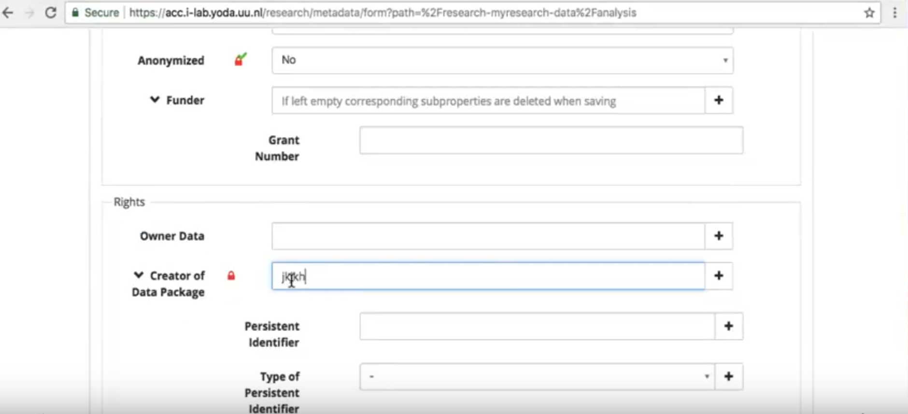
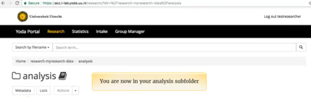

# Manual:  &nbsp; How to publish your data on Yoda

## Introduction

Yoda is a data management system and stands for “Your Data”. Think of it as a way to store, manage, share, secure, add metadata and publish your research data. 

Yoda enables you to:

- Publish your dataset with a DOI enabling you to:
  - Refer to your dataset in articles or other datasets
  - Allowing access to your dataset (or not) 
  - Make your dataset findable in the Yoda Catalogue via its metadata

- Store your data for at least 10 years in a frozen state together with a standardized set of metadata

- Collaborate with fellow researchers on research data in a shared data storage

This manual describes the steps a researcher needs to take to store and publish his/her research data on YODA with a DOI.

For more information about how to collaborate with fellow researchers please go to  https://yoda.sites.uu.nl

## Workflow store and publish data on Yoda

- 
    - [1.	Connect to Yoda file storage](#1connect-to-yoda-file-storage)
      - [1.1 Connect from Mac](#11-connect-from-mac)
      - [1.2 Connect to Yoda file storage from Windows](#12-connect-to-yoda-file-storage-from-windows)
    - [2. Drag and drop your data to Yoda](#2-drag-and-drop-your-data-to-yoda)
    - [3. Add Metadata to your data in Yoda](#3-add-metadata-to-your-data-in-yoda)
    - [4. Lock your data to secure it](#4-lock-your-data-to-secure-it)
    - [5. Submit your data to be stored in the Vault](#5-submit-your-data-to-be-stored-in-the-vault)
    - [6. Publish the data](#6-publish-the-data)

### 1.	Connect to Yoda file storage

#### 1.1 Connect from Mac

Go to Finder &nbsp; &nbsp;

#### 1.2 Connect to Yoda file storage from Windows

Click on This PC

Then right click

Instead of https://your_server_name.data.uu.nl shown in the image below type https://i-lab.data.uu.nl

### 2. Drag and drop your data to Yoda

In this next step you will drag and drop data from your PC or laptop’s folder to Yoda. The screenshots below show this for a Mac, for Windows the procedure is similar.

### 3. Add Metadata to your data in Yoda

The data you just stored needs to have a standardised (for IMAU) set of metadata so that it will be findable in the Yoda Catalogue. Suppose you have the ‘analysis’ subfolder in Yoda that you added in section 2. This section shows how to add Metadata to this folder.

First sign in with your solis-id and password

Make sure that you fill in all the 5 mandatory fields 

Click the save button if you want to test this

If you go back later to finish the screen you will see this:

Fill in at least all mandatory fields

Before you submit the data lock the data to secure it 

### 4. Lock your data to secure it

To safeguard your data from being overwritten you can lock a folder and all its sub-folders.
- Navigate to the portal, log on and click on Research in the top-menu.
- Navigate to the folder you want to protect.
- Press the button Lock – once. The folder and all its contents will be protected.

Locked data can not be changed but Unlocking is possible. Data can be locked by

- the user
- the system

Yoda will lock the data when it is submitted to the so called Vault.
The Vault is the place to store the data for a longer period. Only checked data will find its way to the Vault. Data is stored in the Vault as a datapackage: data together with its metadata. Only datapackages in the Vault can be published (to guarantee integrity of the publication)

In case a user locked the data, it can be unlocked at any time.

### 5. Submit your data to be stored in the Vault

Through submitting you can copy (part of) your folder-tree in the Research Area to the Vault for long term storage. This part of the folder tree is called a datapackage.
You can submit a datapackage by navigating in the Portal to a folder in your Research Area and submit it to the Vault. 
Submit is only possible after adding Metadata.

Ready! You submitted the data

### 6. Publish the data

As a researcher, you can choose to publish your data.

By publishing you can make the metadata of your datapackage findable in the Catalogue.

You can only publish a datapackage already archived in the Vault. Please note that making the metadata accessibility does not imply that the data in the datapackage is accessible as well. 

To enable the accessibility of  the datapackage, you should set the Data Package Access in the metadata form to Open – freely retrievables.

**Researcher**

Publishing is initiated by the researcher in the Research module.

*In the next example we consider the group “myresearch-data”  with subfolders:*

*We want to publish “documentation”*

Note that it is a datapackage in the Vault that can be published.

So the data you want to publish can only be found in “vault-myresearch-data”.

As a researcher you have, besides the listing of the research-…….., a listing of the vault-…….. of your usergroups.
See Grant/Revoke access of researcher.

You could find the package by a search by status “Unpublished” in the Vault.

Click the dropdown next to “Unpublished” and choose “Submit for publication”.

You get an important message.

You have to confirm the agreement.
A message “Submission pending” is shown.

**Datamanager**

Go to your data manager Michael Kliphuis (BBL room 6.65) or write him an email (m.kliphuis@uu.nl)

The datamanager will do a search on “Submitted for publication”.

The datamanager will check your package and Approve for publication.

The status will show “Approved for publication ”

And after a while (refresh screen) the status will be “Published”.

**Researcher**

As a researcher you will find your package in the listing after a search on “Published”.

